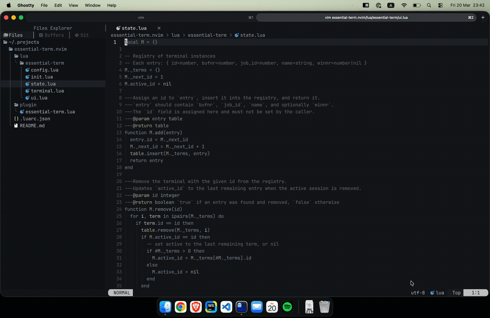

# essential-term.nvim

A lightweight Neovim terminal plugin with multiple named sessions, two display modes, and a built-in session-picker UI.

## Demo

### Horizontal mode


### Float mode



## Features

- Multiple terminal sessions, each with a persistent buffer and shell process
- Sessions survive window closes — only the window is hidden, not the shell
- Two display modes: `horizontal` (bottom split) and `float` (centered floating window)
- **Horizontal mode:** a sidebar listing all sessions appears automatically when 2+ sessions are open
- **Float mode:** a tabline above the float shows all sessions
- Both the sidebar and tabline are mouse-clickable for direct session switching
- Cycle between sessions without closing/reopening splits
- Rename sessions interactively

## Requirements

- Neovim >= 0.9
- [nui.nvim](https://github.com/MunifTanjim/nui.nvim)

## Installation

### lazy.nvim

```lua
{
  "wr9dg17/essential-term.nvim",
  lazy = false,
  dependencies = { "MunifTanjim/nui.nvim" },
  config = function()
    require("essential-term").setup({
      display_mode = "horizontal", -- or "float"
      size = 70,                   -- percentage of editor height/width
    })
  end,
  keys = {
    { "<C-`>",  "<cmd>EssentialTermToggle<cr>", mode = { "n", "t" } },
    { "<C-\\>", "<cmd>EssentialTermToggle<cr>", mode = { "n", "t" } },
    { "<C-t>",  "<cmd>EssentialTermNew<cr>",    mode = { "n", "t" } },
    { "<C-x>",  "<cmd>EssentialTermClose<cr>",  mode = { "n", "t" } },
    { "<C-h>",  "<cmd>EssentialTermPrev<cr>",   mode = { "t" } },
    { "<C-l>",  "<cmd>EssentialTermNext<cr>",   mode = { "t" } },
  },
}
```

### packer.nvim

```lua
use {
  "wr9dg17/essential-term.nvim",
  config = function()
    require("essential-term").setup()
  end,
}
```

## Configuration

All options and their defaults:

```lua
require("essential-term").setup({
  shell           = vim.o.shell,   -- shell executable
  size            = 70,            -- percentage of editor lines/columns used by the terminal
  display_mode    = "horizontal",  -- "horizontal" | "float"
  sidebar_width   = 22,            -- width of the session-picker sidebar (horizontal mode)
  border          = "rounded",     -- border style for float mode (see :h nvim_open_win)
  close_on_exit   = true,          -- destroy session when shell exits
  start_in_insert = true,          -- enter insert mode on open/focus
  colors          = {              -- optional terminal window colors
    bg = nil,                      --   hex color string, e.g. "#1e1e2e"; nil uses default bg
    fg = nil,                      --   hex color string; nil uses default fg
  },
})
```

### Display modes

| Mode | Behaviour |
|------|-----------|
| `"horizontal"` | Opens a bottom split. A sidebar listing sessions appears on the left of the terminal when 2+ sessions exist. |
| `"float"` | Opens a centered floating window with a rounded border. A one-line tabline floats above it when 2+ sessions exist. |

## Commands

| Command | Description |
|---------|-------------|
| `EssentialTermToggle` | Show the terminal (creating one if needed), or hide all visible terminals |
| `EssentialTermNew` | Create a new terminal session |
| `EssentialTermClose` | Destroy the active session |
| `EssentialTermNext` | Cycle to the next session |
| `EssentialTermPrev` | Cycle to the previous session |
| `EssentialTermRename [name]` | Rename the active session (prompts if no argument given) |

## Lua API

```lua
local term = require("essential-term")

term.setup(opts)          -- initialise with options (call once)
term.toggle()             -- show / hide terminal panel
term.new()                -- create a new session
term.close()              -- destroy the active session
term.next()               -- switch to next session
term.prev()               -- switch to previous session
term.goto_index(n)        -- jump directly to session number n (1-based)
term.rename("my-shell")   -- rename active session
```

## Project structure

```
lua/essential-term/
├── init.lua      -- Public API
├── state.lua     -- Data model (registry of sessions)
├── terminal.lua  -- Lifecycle: create, show, hide, swap, destroy
├── ui.lua        -- Sidebar (horizontal) + tabline (float) renderers
└── config.lua    -- Defaults + user config merge
plugin/
└── essential-term.lua  -- User commands + autocmds (auto-sourced)
```

## License

MIT
